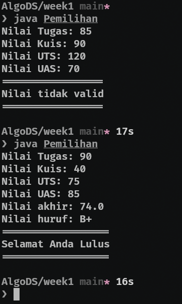
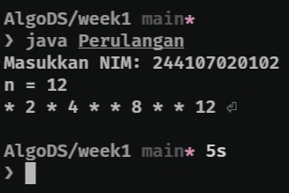
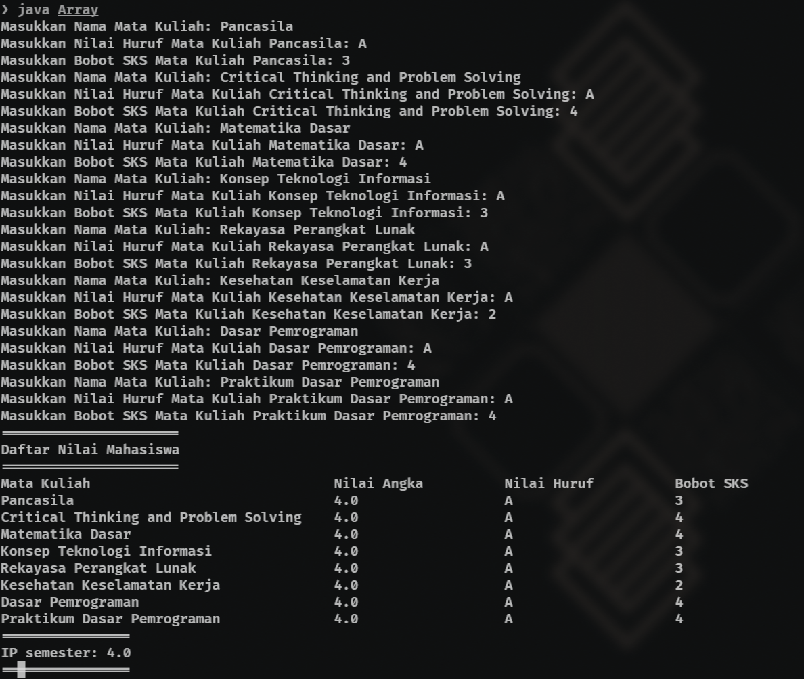
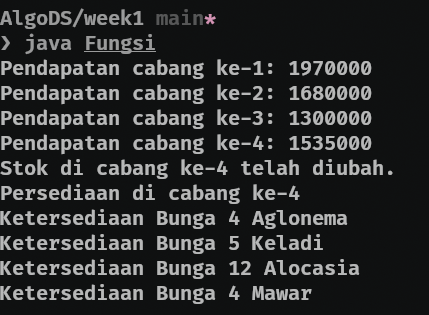
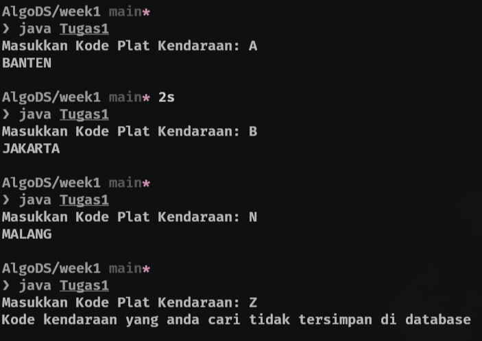
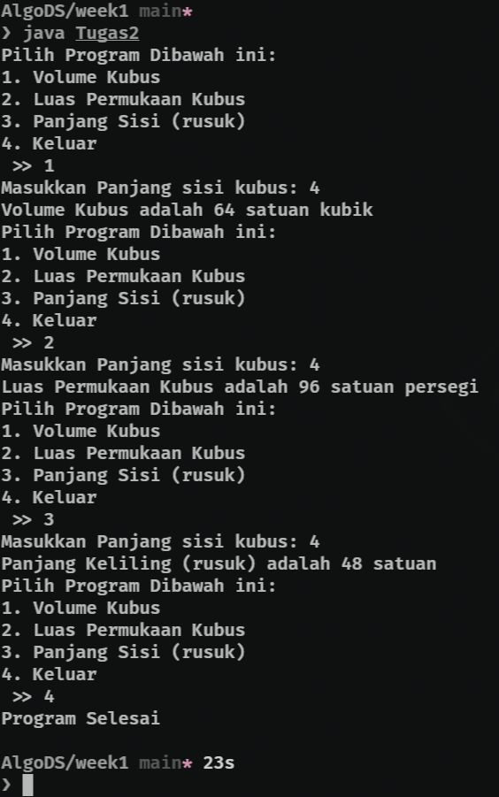
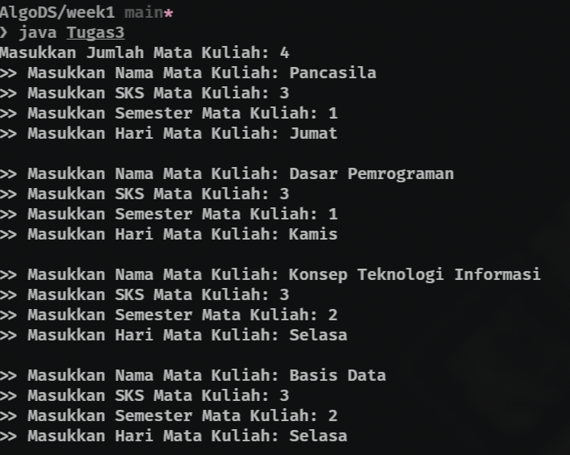
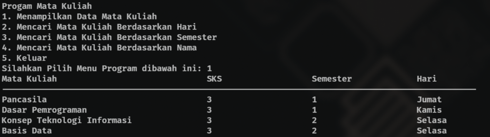
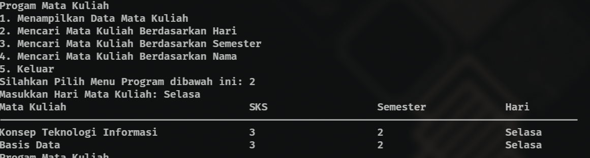
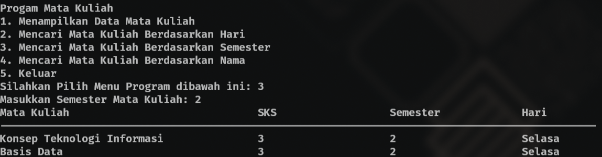

|  | Algorithm and Data Structure |
|--|--|
| NIM |  244107020102|
| Nama |  Singgih Wahyu Permana |
| Kelas | TI - 1H |
| Repository | [link](https://github.com/eeswepe/AlgoDS) |

# Labs #1 Programming Fundamentals Review

## 2. Practice

### 2.1.1. Selection Solution

The solution is implemented in Pemilihan.java, and below is screenshot of the result.

**Brief explanaton:** There are 4 main steps in my program: 
1. Input all grades
2. Validate the input
3. Calculate and convert the final grade
4. Decide the final status

### 2.2.1. Looping Solution
The solution is implemented in Perulangan.java, and below is the screenshot of the result

 

**Brief Explanation:** There are 7 main steps in my program:
1. Input the NIM
2. Take the two last digits using substring function and parse it to Integer
3. Check whether the last two digits are less then 10, if yes, add 10. 
4. Save the result to N (variabel)
5. iterate i from 1 to N
6. if i is 6 or 10, skip the iteration
7. if i is an odd number, print out "*". else print the i

### 2.3.1 Array Solution

The solution is implemented in Array.java, and below is the screenshot of the result

 

**Brief Explanation:** there are 7 main steps in my program 
1. Initiate the arrays to store the courses data
2. Input all of courses data
3. Validate the letter grade
4. Convert the letter grade to GPA Equivalent
5. Store and accumulate credit weights
6. Calculate GPA
7. Display the result

### 2.4.1 Function Solution

The solution is implemented in Fungsi.java, and below is the screenshot of the result

 

**Brief Explanation:** There are 5 main steps in my program

1. Initialize the Flower Stock data
2. Calculate the revenue for each branch
3. Print the revenue
4. Update Stock for the specific branch
5. Print update stock for the specific branch

## 3. Assignment 

### 3.1 First Assignment Solution
The solution is implemented in Tugas1.java, and below is the screenshot of the result

 

**Brief Explanation:** There are 5 steps in my program
1. Initialize license plate codes and city name
2. Take input from user
3. Search for the entered code
\- [ Matching the inputed code with each element of license code array ]
5. Display the corresponding city
\- [ Display the element of city name array which have same index with the founded city code ]
7. Handle invalid codes
\- [ If the search step doesn find any match, print an error message ]

### 3.2 Second Assignment Solution
The solution is implemented in Tugas2.java, and below is the screenshot of the result

 

**Brief Explanation:** There are 5 main steps in my program
1. Define Mathematical function
\- Volume = side power 3
\- Surface Area = side * side * 6
\- Edge Length = side * 12
3. Display menu option
4. Take user input and process selection
5. Perform the corresponding calculation
6. Exit or repeat the program

### 3.3 Third Assignment
The solution is implemented in Tugas3.java, and below is the screenshot of the result

**Brief Explanation:** there are 7 main steps in my program 
1. Initialize and input course data
2. Display a menu for user interaction
3. Display all course data
4. Search courses by criteria
\- By Day [ Mathcing the inputed string with each element of array that contain the day data ]
\- By Semester [ Mathcing the inputed Semester with each element of array that contain the semester data ]
\- By Name [ Matching the inputed name with each element of array that contain name data ]
5. Handle invalid searches
\- [ If the search step doesn find any match, print an error message ]
7. Exit or repeat program

