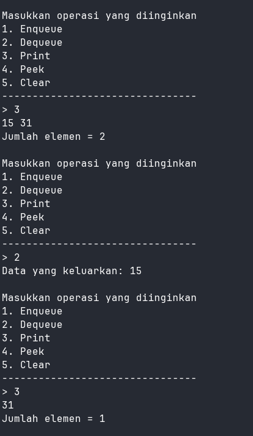
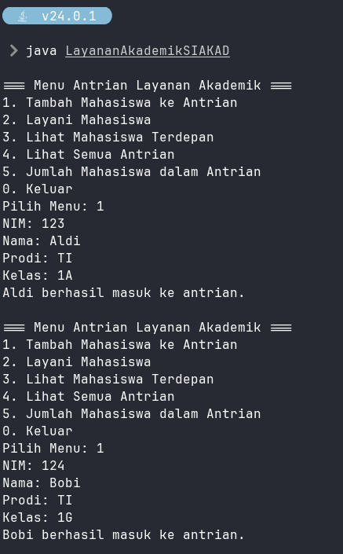

|  | Algoritma dan Struktur Data |
|--|--|
| NIM |  244107020102|
| Nama |  Singgih Wahyu Permana |
| Kelas | TI - 1H |
| Repository | [link](https://github.com/eeswepe/AlgoDS) |

# Queue 

## 2. Praktikun

### 2.1.2 Verifikasi Hasil Percobaan




### 2.1.3 Jawaban Pertanyaan

1. Nilai awal atribut front dan rear diatur ke -1 karena pada saat queue baru dibuat, belum ada elemen yang dimasukkan, sehingga kedua atribut tersebut belum menunjuk ke indeks mana pun di dalam queue. Sedangkan untuk atribut size, diberikan nilai awal 0 karena jumlah elemen yang ada di dalam queue pada saat awal masih kosong, alias belum ada data sama sekali.

2. Pada saat nilai rear sudah mencapai posisi paling akhir array, yaitu ketika rear sama dengan max - 1, maka rear akan di-reset kembali menjadi 0. Hal ini bertujuan agar queue bersifat melingkar (circular queue), di mana elemen baru dapat dimasukkan kembali ke posisi awal array, yakni indeks 0, jika memang masih tersedia ruang kosong.

3. Jika posisi front saat ini sudah berada di indeks terakhir array, yaitu ketika nilainya sama dengan max - 1, maka front akan diatur kembali menjadi 0. Tujuan dari langkah ini adalah untuk menjaga mekanisme circular queue, sehingga saat melakukan dequeue berikutnya, pengambilan data dapat dilakukan kembali dari indeks paling awal, yaitu indeks 0.

4. Variabel i pada proses perulangan dimulai dari front karena posisi front bisa saja berada di indeks selain 0, tergantung dari operasi dequeue yang sebelumnya telah dilakukan. Misalnya, jika sebelumnya sudah ada satu data yang dikeluarkan, maka front akan berada di indeks 1. Oleh karena itu, jika perulangan dimulai dari 0, maka data yang sudah tidak lagi menjadi bagian dari queue akan ikut tercetak. Dengan memulai dari front, yang akan ditampilkan hanyalah data yang masih tersisa dalam queue.

5. Potongan kode tersebut berfungsi untuk mengimplementasikan konsep circular queue, di mana saat proses pencetakan data, indeks i dihitung menggunakan rumus tertentu agar bisa kembali ke awal array (indeks 0) ketika sudah mencapai batas akhir array. Dengan begitu, data dalam queue dapat terus dibaca secara melingkar tanpa keluar dari batas array.

6. Kode peringatan tentang queue overflow terdapat pada baris kode dibawah
```java
if (isFull()) {
    System.out.println("Queue sudah penuh.");
}
```

7. Modifikasi program yang dilakukan terdapat pada fungsi Main, dimana dalam switch case 1 dan 2 ditambahkan kondisi untuk mencek apakah queue sudah penuh ataupun queue masih kosong. berikut adalah kode yang saya tambahkan.
```java
          if (Q.isFull()) {
            System.out.println("Queue sudah penuh.");
            return;
          }
```
dan
```java
          if (Q.isEmpty()) {
            System.out.println("Queue masih kosong.");
            return;
          }
```

## 2.2.2 Verifikasi Hasil Percobaan




### 2.2.3 Jawaban Pertanyaan

1. Berikut adalah kode yang saya gunakan untuk mencetak elemen paling belakand dari queue.
```java
  public void lihatAkhir() {
    if (isEmpty()) {
      System.out.println("Antrian kosong.");
    } else {
      System.out.print("Mahasiswa terakhir: ");
      System.out.println("NIM - NAMA - PRODI - KELAS");
      data[rear].tampilkanData();
    }
  }

```

## 2.3 Tugas

### **Laporan Praktikum**

---

#### **Studi Kasus: Antrian Layanan KRS**

Dalam program ini, terdapat tiga file utama yaitu **Mahasiswa.java**, **AntrianKRS.java**, dan **LayananKRS.java**.

---

#### **1. Mahasiswa.java**

File ini berisi deklarasi **class Mahasiswa** yang merepresentasikan data mahasiswa.

##### **Atribut**

* **nim** → Nomor Induk Mahasiswa.
* **nama** → Nama Mahasiswa.
* **prodi** → Program Studi Mahasiswa.
* **kelas** → Kelas Mahasiswa.

##### **Konstruktor**

Konstruktor dengan parameter yang menginisialisasi semua atribut di atas.

##### **Method**

* **tampilkanData()** → Menampilkan data mahasiswa lengkap dalam satu baris.

---

#### **2. AntrianKRS.java**

File ini berisi class **AntrianKRS** yang merepresentasikan antrian mahasiswa dalam proses KRS.

##### **Atribut Utama**

* Array **data\[]** untuk menyimpan antrian.
* **front, rear, size, max, kuota** untuk mengelola antrian.

##### **Method Utama**

* **tambahAntrian(Mahasiswa mhs)** → Menambahkan mahasiswa ke antrian.
* **layaniMahasiswa()** → Melayani 2 mahasiswa terdepan.
* **tampilkanSemua()** → Menampilkan semua mahasiswa dalam antrian.
* **lihatDuaTerdepan()**, **lihatTerakhir()**, **clear()**, **getJumlahAntrian()**, **getMhsSudahProses()**, **getMhsBelumProses()** → Fitur tambahan pengelolaan antrian.

---

#### **3. LayananKRS.java**

File ini merupakan program utama untuk mengelola antrian mahasiswa KRS.

##### **Operasi yang Dilakukan**

* Menyediakan **menu interaktif** untuk menambah, melayani, dan melihat data antrian.
* Memungkinkan pengguna melihat mahasiswa yang sudah atau belum diproses KRS.
* Menyediakan fitur untuk menghapus seluruh antrian.

