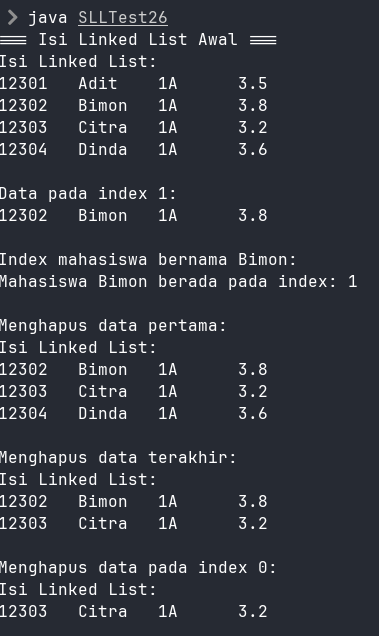
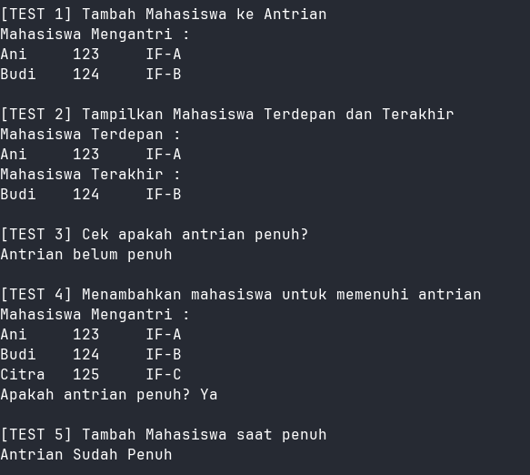
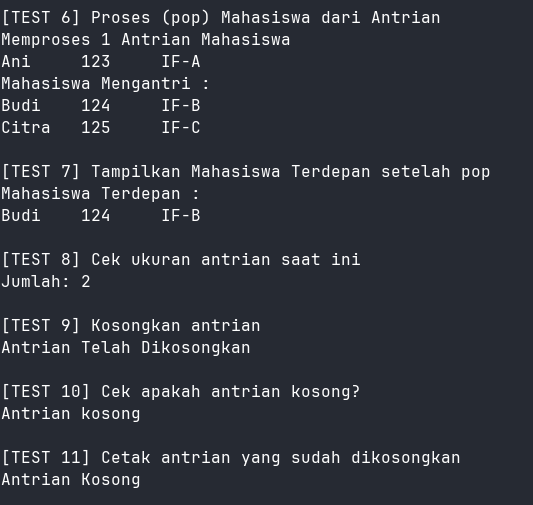

|  | Algoritma dan Struktur Data |
|--|--|
| NIM |  244107020102|
| Nama |  Singgih Wahyu Permana |
| Kelas | TI - 1H |
| Repository | [link](https://github.com/eeswepe/AlgoDS) |

# Linked List

## Praktikum

### 2.1.1 Verifikasi hasil percobaan

### 2.1.2 Jawaban Pertanyaan

1. Karena pada awal inisiasi, linked list masih belum memiliki isi apapun
2. Variabel `temp` berfungsi untuk menjadi referensi pada node head yang mana adalah node paling awal dari linkedlist tersebut.
3. Modifikasi saya lakukan pada fungsi Main, sehingga memungkinkan untuk pengguna memasukkan data menggunakan Scanner.

### 2.2.2 Verifikasi hasil percobaan

### 2.2.3 Jawaban Pertanyaan

1. Break digunakan agar setelah menghapus data yang ditemukan pertama kali, program tidak melanjutkan sequentialnya sampai ke akhir program. Hal ini ditujukan untuk memastikan fungsi remove hanya menghapus 1 Node saja, yaitu node yang pertama kali sesuai dengan kriteria.
2. Pada baris pertama, kode tersebut berfungsi untuk "melewati" elemen yang ada pada temp.next, sehingga element yang sebelumnya berada di temp.next akan diabaikan jika terjadi sequential searching lagi.

## Tugas

Dihasilkan 4 file utama dalam program ini, yaitu:

- [Antrian.java](./Antrian.java)
- [AntrianMain.java](./AntrianMain.java)
- [AntrianTest.java](./AntrianTest.java)
- [MhsAntri.java](./MhsAntri.java)

Di dalam file [Antrian.java](./Antrian.java), adalah class yang menangani antrian mahasiswa.

Di dalam file [AntrianMain.java](./AntrianMain.java), adalah class yang menangani inputan dari user, dan menampilkan output ke layar.

Di dalam file [AntrianTest.java](./AntrianTest.java), adalah class yang menjalankan test dari antrian mahasiswa.

Di dalam file [MhsAntri.java](./MhsAntri.java), adalah class yang menangani data mahasiswa.

Setelah melakukan pengujian setiap fitur menggunakan file [AntrianTest.java](./AntrianTest.java), program menghasilkan output sesuai dengan yang diharapkan. berikut adalah hasil running dari [AntrianTest.java](./AntrianTest.java)

