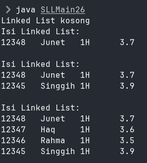

|  | Algoritma dan Struktur Data |
|--|--|
| NIM |  244107020102|
| Nama |  Singgih Wahyu Permana |
| Kelas | TI - 1H |
| Repository | [link](https://github.com/eeswepe/AlgoDS) |

# Linked List

## Praktikum

### 2.1.1 Verifikasi hasil percobaan

### 2.1.2 Jawaban Pertanyaan

1. Karena pada awal inisiasi, linked list masih belum memiliki isi apapun
2. Variabel `temp` berfungsi untuk menjadi referensi pada node head yang mana adalah node paling awal dari linkedlist tersebut.
3. 
