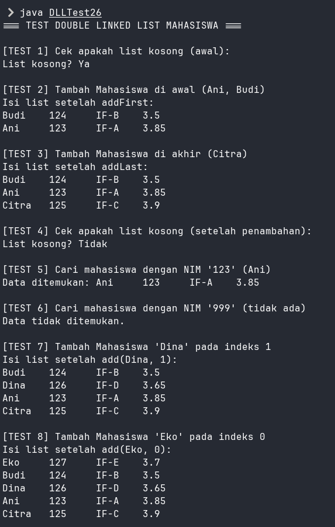
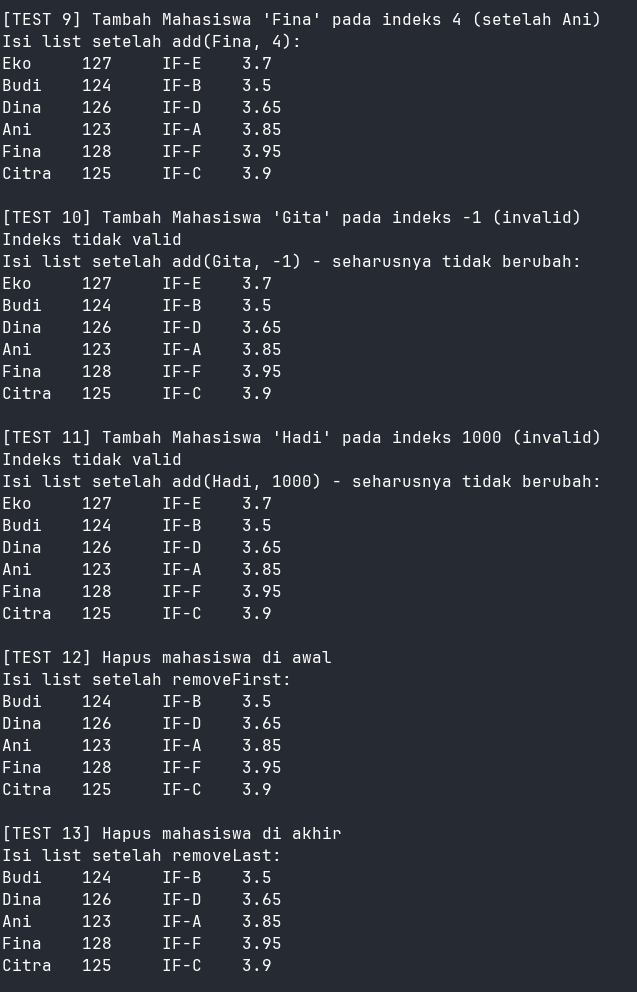
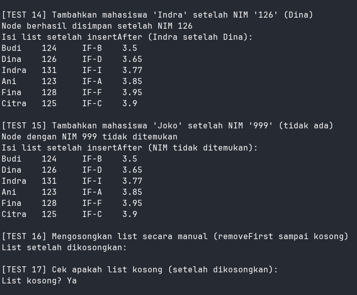

|  | Algoritma dan Struktur Data |
|--|--|
| NIM |  244107020102|
| Nama |  Singgih Wahyu Permana |
| Kelas | TI - 1H |
| Repository | [link](https://github.com/eeswepe/AlgoDS) |

# Double Linked List

## Praktikum

### 12.2.1 Verifikasi Hasil Percobaan 





### 12.2.2 Jawaban Pertanyaan Percobaan 1

1. Singly linked list hanya memiliki satu arah, yaitu tiap node menyimpan pointer ke node berikutnya.
Doubly linked list memiliki dua arah karena tiap node menyimpan pointer ke node berikutnya dan node sebelumnya. Ini membuat traversing ke dua arah lebih fleksibel tapi memakan lebih banyak memori.

2. Atribut next digunakan untuk menunjuk ke node berikutnya dalam linked list. Sedangkan prev digunakan untuk menunjuk ke node sebelumnya, yang menandakan bahwa node ini adalah bagian dari doubly linked list. Keduanya memungkinkan traversal maju dan mundur dalam struktur data.

3. Konstruktor DoubleLinkedList01() digunakan untuk menginisialisasi linked list saat objek dibuat. Dengan mengatur head = null dan tail = null, ini menunjukkan bahwa linked list masih kosong, belum memiliki node sama sekali.

4. Kode tersebut berarti jika linked list masih kosong (tidak punya node), maka node baru (newNode) akan menjadi head dan tail sekaligus.

5. Statement head.prev = newNode berarti kita menghubungkan node baru ke node yang sebelumnya menjadi head. Karena kita menambahkan di awal (addFirst), maka node baru harus menjadi sebelumnya (prev) dari node head yang lama.

6. Kode yang ditambahkan untuk pengecekan
```java
    if (isEmpty()) {
      System.out.println("List kosong");
      return;
    }
```

7. Kode ini berarti node yang setelah current (yaitu current.next) akan memiliki prev (sebelumnya) yang baru, yaitu newNode. Tujuannya adalah untuk menghubungkan node baru (newNode) ke arah mundur dalam doubly linked list agar struktur list tetap konsisten.

### 12.2.3 Jawaban Pertanyaan Percobaan 2

1. Baris head = head.next; berarti kita menghapus node pertama dengan menggeser head ke node berikutnya. Lalu head.prev = null; digunakan untuk memutus hubungan dengan node lama yang sudah dihapus agar tidak ada referensi balik ke node tersebut.

2. Hasil modifikasi program
```java
  public void removeFirst() {
    if (isEmpty()) {
      System.out.println("List kosong");
      return;
    }
    if (head == tail) {
      head = tail = null;
      System.out.println("Data yang dihapus: " + head.data.tampil());
      return;
    } else {
      head = head.next;
      head.prev = null;
      System.out.println("Data yang dihapus: " + head.data.tampil());
    }
  }

  public void removeLast() {
    if (isEmpty()) {
      System.out.println("List kosong");
      return;
    }
    if (head == tail) {
      head = tail = null;
    System.out.println("Data yang dihapus: " + tail.data.tampil());
      return;
    }else{
      tail = tail.prev;
      tail.next = null;
      System.out.println("Data yang dihapus: " + tail.data.tampil());
    }
  }
```


