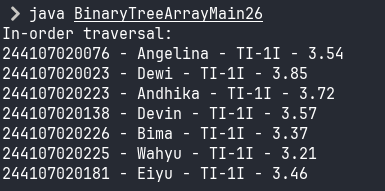

|  | Algoritma dan Struktur Data |
|--|--|
| NIM |  244107020102|
| Nama |  Singgih Wahyu Permana |
| Kelas | TI - 1H |
| Repository | [link](https://github.com/eeswepe/AlgoDS) |

# STACK

## 2. Praktikum

### 2.1.2 Verifikasi Hasil Percobaan


### 2.1.3 Jawaban Pertanyaan

1. Untuk menampilkan daftar tugas mahasiswa dari yang paling baru hingga yang paling lama, perbaikan perlu dilakukan pada metode print di dalam kelas StackTugasMahasiswa. Secara spesifik, inisialisasi nilai awal pada perulangan di dalam metode print harus diubah menjadi i = top. Hal ini akan memastikan bahwa elemen stack diakses mulai dari indeks teratas (top), yang merepresentasikan data terbaru, hingga indeks terbawah, yang merepresentasikan data terlama.

2. Merujuk pada baris kode yang melakukan inisialisasi, jumlah mahasiswa yang dapat ditampung adalah 5.

```java
StackTugasMahasiswa26 stack = new StackTugasMahasiswa26(5);
```

3. Pengecekan kondisi !isFull() sebelum penambahan data baru ke dalam stack adalah langkah penting untuk menghindari kondisi stack overflow. Kondisi ini terjadi ketika kita mencoba memasukkan data ke dalam stack yang sudah mencapai kapasitas maksimumnya. Penghapusan kontrol if-else yang memeriksa ketersediaan ruang akan menyebabkan program tetap memaksa operasi penambahan data meskipun stack penuh, sehingga memicu stack overflow.

4. Perubahan kode untuk melihat tugas terbawah
```java
  public Mahasiswa26 lihatTerbawah() {
    if (!isEmpty()) {
      return stack[0];
    } else {
      System.out.println("Stack kosong! Tidak ada tugas yang dikumpulkan.");
      return null;
    }
  }
```

5. Untuk melihat jumlah tugas yang sudah dikumpulkan, berikut adalah kode utama yang digunakan.
```java
  public void jumlahTugas() {
    if (isEmpty()) {
      System.out.println("Stack kosong! Tidak ada tugas yang dikumpulkan.");
    } else {
      System.out.println("Jumlah Tugas yang Sudah Dikumpulkan: " + (top + 1));
    }
```

### 2.2.2 Percobaan



### 2.2.3 Jawaban Pertanyaan

1. Metode konversiDesimalKeBiner bekerja dengan menerima sebuah parameter berupa angka desimal. Di dalam metode ini, dibuat sebuah objek stack dari kelas StackKonversi dengan kapasitas tetap sebesar 32. Selanjutnya, program memasuki perulangan while yang akan terus berjalan selama nilai lebih dari 0 dan kurang dari atau sama dengan 100. Dalam setiap iterasi, program menghitung sisa hasil bagi dari nilai % 2 dan menyimpannya ke dalam variabel sisa. Nilai sisa ini kemudian dimasukkan ke dalam stack menggunakan metode push. Setelah itu, nilai akan diperbarui dengan hasil pembagian nilai / 2. Ketika perulangan selesai, dibuat sebuah variabel bertipe String bernama biner. Lalu dilakukan perulangan lagi, kali ini untuk mengambil setiap elemen dari stack menggunakan metode pop, dan menambahkannya ke variabel biner. Setelah stack kosong, metode ini akan mengembalikan nilai dari variabel biner sebagai hasil konversi.

2. Jika kondisi perulangan diubah menjadi while (kode != 0), maka program tetap akan menjalankan proses konversi selama nilai yang dimasukkan bukan nol. Namun, ini menimbulkan masalah jika pengguna memasukkan nilai negatif. Dalam kasus tersebut, program tetap menganggap nilainya valid karena masih memenuhi kondisi kode != 0, padahal nilai negatif tidak semestinya dikonversi ke bentuk biner dalam konteks ini. Akibatnya, perhitungan akan tetap dilakukan — sisa hasil bagi dari angka negatif akan disimpan ke stack dan proses akan berjalan tidak sesuai logika yang diinginkan. Sebaliknya, jika kondisi perulangannya tetap menggunakan kode > 0, maka input yang bernilai nol atau negatif secara otomatis akan dilewati dan tidak akan menghasilkan representasi biner apapun. Oleh karena itu, untuk memastikan hanya nilai valid yang diproses, sebaiknya gunakan kondisi kode > 0.

## 2.4 Latihan

Berikut adalah hasil running dari program yang telah dibuat dalam latihan.


