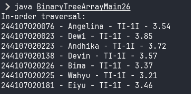

|  | Algoritma dan Struktur Data |
|--|--|
| NIM |  244107020102|
| Nama |  Singgih Wahyu Permana |
| Kelas | TI - 1H |
| Repository | [link](https://github.com/eeswepe/AlgoDS) |

# Tree

## 14.2 Percobaan 1

### 14.2.1 Praktikum

Verifikasi hasil Percobaan


### 14.2.2 Pertanyaan

1. Lebih efisien karena seluruh data yang terdapat dalam binary tree sudah terurutkan
2. Node `left` dan `right` berfungsi untuk menyimpan kedua node 'anak' dari node tersebut
3. a. Fungsi atribut root dalam kelas BinaryTree adalah untuk menyimpan referensi (atau pointer) ke node paling atas dari pohon biner (node akar). Atribut ini berfungsi sebagai titik masuk atau pegangan utama untuk mengakses dan menavigasi seluruh struktur pohon.
3. b. Saat objek BinaryTree pertama kali dibuat dan pohon masih kosong, nilai awal atribut root adalah None atau null, menunjukkan bahwa belum ada node akar (dan belum ada node sama sekali) di dalam pohon tersebut.
4. Ketika tree masih kosong, maka node akan ditambahkan sebagai root 
5.  Pertama, kode ini menggunakan variabel parent untuk melacak node sebelumnya dari current. Kemudian, ia membandingkan ipk data baru dengan ipk current. Jika data baru lebih kecil, ia bergerak ke kiri; jika lebih besar, ia bergerak ke kanan. Pergerakan ini terus dilakukan hingga current menjadi null, yang menandakan lokasi kosong ditemukan. Node baru kemudian dihubungkan ke anak kiri atau kanan parent sesuai arah pergerakan terakhir.
6.  Pertama, getSuccessor bertugas mencari node bernilai minimum di subtree kanan dari node del. Method delete akan memanggilnya dan memberikan node current yang ingin dihapus ke parameter del. Node yang berhasil ditemukan getSuccessor inilah yang nantinya dipakai untuk menggantikan posisi node current yang dihapus, memastikan pohon tetap tersusun rapi.

## 14.3 Percobaan 3

### 14.3.1 Praktikum

Verifikasi hasil percobaan



### 14.3.2 Pertanyaan

1. Atribut data menyimpan data mahasiswa, sedangkan idxLast melacak indeks elemen terakhir yang benar-benar terisi dalam array. Jadi, jika array memiliki kapasitas 20 elemen dan hanya diisi sampai elemen ke-5, idxLast nilainya adalah 4. 
2. method populateData untuk menambahkan array mahasiswa dan idxLast ke dalam binary tree
3. untuk melakukan traverse pada binary tree array dengan pola left - root - right
4. left child = 5, right child = 6
5. buat nandain kalau posisi indeks terakhir sekarang itu di angka 6. Soalnya datanya ada 7, dan ngitung indeksnya itu dari 0.
6. Rumus 2*idxStart+1 dan 2*idxStart+2 digunakan karena itu adalah cara standar untuk menghitung indeks anak kiri dan kanan dari node pada indeks idxStart dalam representasi array. Pemanggilan rekursif mengikutinya untuk menavigasi struktur pohon biner di dalam array. Dengan mengarahkan ke 2*idxStart+1 untuk nilai lebih kecil dan 2*idxStart+2 untuk nilai lebih besar, algoritma menjaga aturan Binary Search Tree. Ini memastikan penempatan data yang benar agar representasi pohon dalam array tetap terurut logis.

## Tugas

1. Membuat fungsi add rekursif

```java
  Node26 addRekursif(Node26 root, Student26 data) {
    Node26 newNode = new Node26(data);
    if (root == null) {
      root = newNode;
    } else if (newNode.data.ipk < root.data.ipk) {
      root.left = addRekursif(root.left, data);
    } else if (newNode.data.ipk >= root.data.ipk) {
      root.right = addRekursif(root.right, data);
    }
    return root;
  }
```

2. Membuat fungsi getMaxIPK dan getMaxIPK

```java
  Node26 getMinIPK() {
    Node26 current = root;
    while (current.left != null) {
      current = current.left;
    }
    return current;
  }

  Node26 getMaxIPK() {
    Node26 current = root;
    while (current.right != null) {
      current = current.right;
    }
    return current;
  }
```

3. Membuat fungsi menampilkan mahasiswa dengan ipk diatas

```java
  void displayStudentsWithIPKAbove(double ipk, Node26 node) {
    if (node == null) {
      return;
    }
    if (node.data.ipk > ipk) {
      displayStudentsWithIPKAbove(ipk, node.left);
      node.data.print();
    }
    displayStudentsWithIPKAbove(ipk, node.right);
  }
```

4. Menambahkan fungsi add
```java
  void add(Student26 data) {
    int i = 0;
    while (i < this.data.length && this.data[i] != null) {
      if (data.ipk < this.data[i].ipk) {
        i = 2 * i + 1;
      } else {
        i = 2 * i + 2;
      }
    }

    if (i >= this.data.length) {
      System.out.println(
          "\narray sudah penuh (atau tidak ada tempat kosong di jalur yang sesuai IPK)");
      return;
    }

    this.data[i] = data;
    this.idxLast++;
  }
```
   Menambahkan fungsi traverse preorder
```java
  void traversePreOrder(int idxStart) {
    if (idxStart >= data.length) {
      return;
    }

    if (data[idxStart] != null) {
      data[idxStart].print();
      traversePreOrder(2 * idxStart + 1);
      traversePreOrder(2 * idxStart + 2);
    }
  }
```
