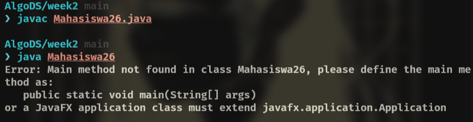
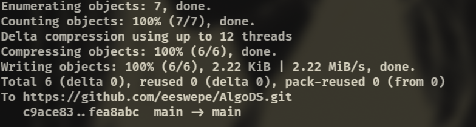
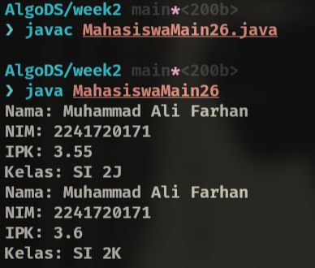

|  | Algoritma dan Struktur Data |
|--|--|
| NIM |  244107020102|
| Nama |  Singgih Wahyu Permana |
| Kelas | TI - 1H |
| Repository | [link](https://github.com/eeswepe/AlgoDS) |

# Object

## 2. Praktikum

### 2.1 Deklarasi Class, Atribut, dan Method

#### 2.1.1 Percobaan
Setelah menyelesaikan seluruh tahapan seperti pada contoh, dihasilkan sebuah file java dengan nama Mahasiswa26.java yang bisa anda cek (disini)

#### 2.1.2 Verifikasi Hasil Percobaan



#### 2.1.3 Pertanyaan

1. Karakteristik yang dimiliki oleh class atau object adalah adanya property dan method

2. Pada Class tersebut, terdapat 4 atribut, diantaranya adalah:
    - Nama
    - NIM
    - Kelas
    - IPK

3. Class tersebut memiliki 4 method diantaranya adalah:
    - tampilkanInformasi
    - ubahKelas
    - updateIpk
    - nilaiKinerja

4. Update perbaikan kode untuk pengecekan
``` java
  void updateIpk(double ipkBaru) {
    if (ipkBaru < 0 || ipkBaru > 4) {
      System.out.println("IPK tidak valid. Harus antara 0.0 dan 4.0");
      return;
    }
    ipk = ipkBaru;
  }
```

5. Cara kerja method nilaiKinerja() adalah dengan mengecek apakah nilai tersebut memenuhi persyaratan tertentu. Dari persyaratan tersebut akan diberikan sebuah string sebagai nilai return dari fungsi tersebut.

6. Commit and push github



### 2.2 Instansiasi Object, serta Mengakses Atribut dan Method

#### 2.2.1 Langkah-langkah Percobaan
Setelah menyelesaikan seluruh tahapan seperti pada contoh, dihasilkan sebuah file java dengan nama MahasiswaMain26.java yang bisa anda cek (disini)

#### 2.2.2 Verifikasi Hasil Percobaan



#### 2.2.3 Pertanyaan
1. baris kode yang menunjukkan instansiasi adalah baris 
``` java
Mahasiswa26 mhs1 = new Mahasiswa26();
```
dimana kode tersebut akan menghasilkan object yang bernama mhs1

2. Cara mengakses atribut maupun method dari suatu object adalah menggunakan dot notation (menggunakan tanda titik yang diikuti nama atribut atau method yang akan diambil)

3. Hasil pemanggilan method tampilkanInformasi() berbeda karena pada baris sebelum pemanggilan method tampilkanInformasi() kedua kita telah melakukan modifikasi data atribut dari object tersebut

### 2.3 Membuat Konstruktor

#### 2.3.1 Langkah-langkah Percobaan


