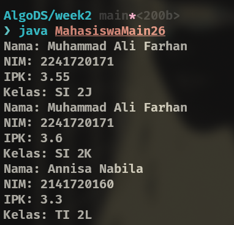

|  | Algoritma dan Struktur Data |
|--|--|
| NIM |  244107020102|
| Nama |  Singgih Wahyu Permana |
| Kelas | TI - 1H |
| Repository | [link](https://github.com/eeswepe/AlgoDS) |

# Object

## 2. Praktikum

### 2.1 Deklarasi Class, Atribut, dan Method

#### 2.1.1 Percobaan
Setelah menyelesaikan seluruh tahapan seperti pada contoh, dihasilkan sebuah file java dengan nama [Mahasiswa26.java](./Mahasiswa26.java) 

#### 2.1.2 Verifikasi Hasil Percobaan


#### 2.1.3 Pertanyaan

1. Karakteristik yang dimiliki oleh class atau object adalah adanya property dan method

2. Pada Class tersebut, terdapat 4 atribut, diantaranya adalah:
    - Nama
    - NIM
    - Kelas
    - IPK

3. Class tersebut memiliki 4 method diantaranya adalah:
    - tampilkanInformasi
    - ubahKelas
    - updateIpk
    - nilaiKinerja

4. Update perbaikan kode untuk pengecekan
``` java
  void updateIpk(double ipkBaru) {
    if (ipkBaru < 0 || ipkBaru > 4) {
      System.out.println("IPK tidak valid. Harus antara 0.0 dan 4.0");
      return;
    }
    ipk = ipkBaru;
  }
```

5. Cara kerja method nilaiKinerja() adalah dengan mengecek apakah nilai tersebut memenuhi persyaratan tertentu. Dari persyaratan tersebut akan diberikan sebuah string sebagai nilai return dari fungsi tersebut.

6. Commit and push github


### 2.2 Instansiasi Object, serta Mengakses Atribut dan Method

#### 2.2.1 Langkah-langkah Percobaan
Setelah menyelesaikan seluruh tahapan seperti pada contoh, dihasilkan sebuah file java dengan nama [MahasiswaMain26.java](./MahasiswaMain26.java)

#### 2.2.2 Verifikasi Hasil Percobaan


#### 2.2.3 Pertanyaan
1. baris kode yang menunjukkan instansiasi adalah baris 
``` java
Mahasiswa26 mhs1 = new Mahasiswa26();
```
dimana kode tersebut akan menghasilkan object yang bernama mhs1

2. Cara mengakses atribut maupun method dari suatu object adalah menggunakan dot notation (menggunakan tanda titik yang diikuti nama atribut atau method yang akan diambil)

3. Hasil pemanggilan method tampilkanInformasi() berbeda karena pada baris sebelum pemanggilan method tampilkanInformasi() kedua kita telah melakukan modifikasi data atribut dari object tersebut

### 2.3 Membuat Konstruktor

#### 2.3.1 Langkah-langkah Percobaan

Pada bagian ini, ditambahkan kode untuk fungsi konstruktor. Selain itu pada class MahasiswaMain26, kita membuat lagi sebuah object baru bernama mhs2 dengan menggunakan fungsi konstruktor yang sudah dibuat sebelumnya

#### 2.3.2 Verifikasi



#### 2.3.3 Pertanyaan
1. Kode baris yang menunjukkan konstruksi berparameter adalah 
``` java
  public Mahasiswa26(String nama, String nim, double ipk, String kelas) {
    this.nama = nama;
    this.nim = nim;
    this.ipk = ipk;
    this.kelas = kelas;
  }
```
2. Pada baris tersebut, yang terjadi adalah kita membuat object baru dengan nama mhs2, dimana setiap atribut pada mhs2 diisikan secara langsung dengan memanggil fungsi konstruktor yang berparameter

3. Saat konstruktor default dihapus, maka terjadi error saat menjalankan program, hal ini karena pada saat kita membuat object mhs1 kita tidak mengisikan parameter untuk fungsi konstruktornya. kenapa sebelumnya berhasil, karena sebelumnya konstruktor yang dipakai adalah konstruktor default, ketika konstruktor default dihapus dan digantikan dengan konstruktor yang memiliki parameter, maka konstruktor yang memiliki parameterlah yang menjadi konstruktor default

4. Tidak, method didalam object bisa dipanggil kapan saja dengan urutan apa saja

5. Object baru mhsSinggih dibuat dengan kode
``` java
    Mahasiswa26 mhsSinggih = new Mahasiswa26("Singgih Wahyu Permana", "244107020102", 4.00, "TI 1H"); 
```
6. Commit and push

### 2.4 Latihan Praktikum
#### 2.4.1 Studi Kasus Mata Kuliah

Dalam program ini, terdapat dua file utama, yaitu [**MataKuliah26.java**](./MataKuliah26.java) dan [**MataKuliahMain26.java**](./MataKuliahMain26.java).  

#### **1. MataKuliah26.java**  
File ini berisi deklarasi **class MataKuliah26**, yang merepresentasikan mata kuliah dengan beberapa atribut dan metode penting.  

##### **Atribut**  
Class ini memiliki empat atribut utama:  
- **kodeMK** → Menyimpan kode unik mata kuliah.  
- **nama** → Menyimpan nama mata kuliah.  
- **sks** → Menyimpan jumlah Satuan Kredit Semester (SKS) dari mata kuliah.  
- **jumlahJam** → Menyimpan jumlah jam perkuliahan dari mata kuliah.  

##### **Konstruktor**  
Terdapat dua konstruktor dalam class ini:  
1. **Konstruktor default** → Digunakan untuk membuat objek tanpa parameter awal.  
2. **Konstruktor dengan parameter** → Memungkinkan inisialisasi langsung dengan kode mata kuliah, nama, jumlah SKS, dan jumlah jam.  

##### **Method**  
Class ini memiliki beberapa method yang digunakan untuk mengelola data mata kuliah:  
- **tampilInformasi()** → Menampilkan informasi lengkap dari mata kuliah.  
- **ubahSKS(int sks)** → Mengubah jumlah SKS dari mata kuliah.  
- **tambahJam(int jam)** → Menambahkan jumlah jam perkuliahan.  
- **kurangiJam(int jam)** → Mengurangi jumlah jam perkuliahan, dengan pengecekan agar tidak bernilai negatif.  


#### **2. MataKuliahMain26.java**  
File ini berfungsi sebagai program utama yang digunakan untuk membuat dan mengelola objek **MataKuliah26**.  

##### **Objek yang Dibuat**  
Program ini mendeklarasikan **dua objek** bertipe **MataKuliah26**, masing-masing menggunakan metode inisialisasi yang berbeda:  
1. **Objek pertama (`daspro`) menggunakan konstruktor default**, lalu nilai atributnya diatur secara manual.  
2. **Objek kedua (`KTI`) menggunakan konstruktor dengan parameter**, sehingga nilainya langsung diatur saat objek dibuat.  

##### **Operasi yang Dilakukan**  
- Objek `daspro` (Dasar Pemrograman) dibuat dengan konstruktor default, lalu diisi dengan informasi mata kuliah secara manual. Setelah itu, informasi mata kuliah ditampilkan, jumlah jam dikurangi, jumlah SKS diperbarui, dan informasi diperiksa kembali.  
- Objek `KTI` (Konsep Teknologi Informasi) dibuat langsung dengan konstruktor berparameter. Setelah itu, informasi mata kuliah ditampilkan, jumlah jam ditambah, dan hasilnya ditampilkan kembali.  

Dengan implementasi ini, program menunjukkan bagaimana sebuah class dapat digunakan untuk merepresentasikan mata kuliah dan bagaimana data dapat dimodifikasi melalui metode yang tersedia.

---
#### 2.4.1 Studi Kasus Dosen


Dalam program ini, terdapat dua file utama, yaitu [**Dosen26.java**](./Dosen26.java) dan [**DosenMain26.java**](./DosenMain26.java).

#### **1. Dosen26.java**  
File ini berisi deklarasi **class Dosen26**, yang merepresentasikan data seorang dosen dengan berbagai atribut dan metode yang berkaitan dengan informasi dosen.

##### **Atribut**  
Class ini memiliki lima atribut utama:  
- **idDosen** → Menyimpan ID unik dari dosen.  
- **nama** → Menyimpan nama dosen.  
- **statusAktif** → Menunjukkan apakah dosen masih aktif atau tidak.  
- **tahunBergabung** → Menyimpan tahun pertama dosen bergabung.  
- **bidangKeahlian** → Menyimpan spesialisasi atau bidang keahlian dari dosen.  

##### **Konstruktor**  
Class ini memiliki dua konstruktor:  
1. **Konstruktor default** → Digunakan untuk membuat objek dosen tanpa parameter awal.  
2. **Konstruktor dengan parameter** → Memungkinkan inisialisasi objek dengan ID dosen, nama, status aktif, tahun bergabung, dan bidang keahlian secara langsung.  

##### **Metode**  
Class ini memiliki beberapa metode untuk mengelola data dosen:  
- **tampilInformasi()** → Menampilkan informasi lengkap mengenai dosen.  
- **setStatusAktif(boolean statusAktif)** → Mengubah status keaktifan dosen dan menampilkan perubahan status.  
- **hitungMasaKerja(int thnSkrg)** → Menghitung masa kerja dosen berdasarkan tahun saat ini.  
- **ubahKeahlian(String bidang)** → Mengubah bidang keahlian dari dosen dan menampilkan perubahan yang terjadi.  


#### **2. DosenMain26.java**  
File ini berfungsi sebagai program utama yang digunakan untuk membuat dan mengelola objek **Dosen26**.

##### **Objek yang Dibuat**  
Program ini mendeklarasikan **dua objek** bertipe **Dosen26**, dengan metode inisialisasi yang berbeda:  
1. **Objek pertama (`dosen1`) menggunakan konstruktor default**, lalu nilai atributnya diatur secara manual.  
2. **Objek kedua (`dosen2`) menggunakan konstruktor dengan parameter**, sehingga nilai atributnya langsung diatur saat objek dibuat.  

##### **Operasi yang Dilakukan**  
- Objek `dosen1` dibuat dengan konstruktor default, kemudian diberikan informasi seperti ID, nama, status keaktifan, tahun bergabung, dan bidang keahlian secara manual.  
  - Informasi dosen ditampilkan.  
  - Bidang keahlian diubah.  
  - Informasi dosen ditampilkan kembali setelah perubahan.  
  - Masa kerja dihitung berdasarkan tahun 2025.  
- Objek `dosen2` dibuat menggunakan konstruktor berparameter dan langsung diisi dengan informasi awal.  
  - Informasi dosen ditampilkan.  
  - Status aktif dosen diubah menjadi **Tidak Aktif**.  
  - Informasi dosen ditampilkan kembali setelah perubahan.  
  - Masa kerja dihitung berdasarkan tahun 2025.  

Dengan implementasi ini, program menunjukkan bagaimana sebuah class dapat digunakan untuk merepresentasikan seorang dosen, serta bagaimana data dapat dimodifikasi melalui metode yang tersedia.
