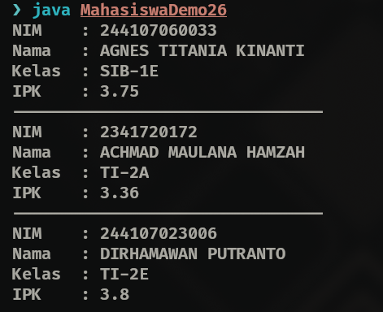
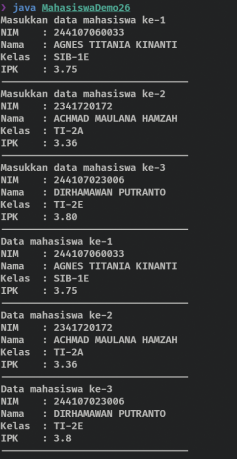
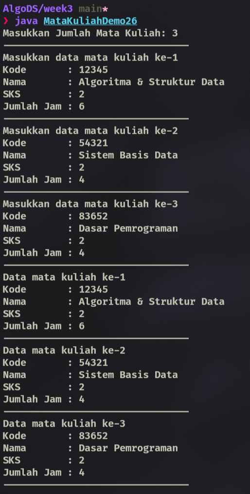

|  | Algoritma dan Struktur Data |
|--|--|
| NIM |  244107020102|
| Nama |  Singgih Wahyu Permana |
| Kelas | TI - 1H |
| Repository | [link](https://github.com/eeswepe/AlgoDS) |

# Array of Objects

## 3. Praktikum

### 3.2 Membuat array dari object, mengisi, dan menampilkan

#### 3.2.1 Percobaan
setelah dilakukan langkah seperti pada jobsheet, dihasilkan sebuah file dengan nama [Mahasiswa26.java](./Mahasiswa26.java)

### 3.2.2 Verikasi Percobaan


### 3.2.3 Pertanyaan

1. Tidak, class yang digunakan untuk membuat array of object tidak selalu harus memiliki atribut dan method sekaligus. Namun dapat hanya memiliki salah satunya.
2. Kode program tersebut bekerja dengan mendeklarasikan sebuah array of object dengan nama arrayOfMahasiswa dengan tipe data Mahasiswa dan panjang array 3 elemen.
3. Meski tidak memiliki baris kode yang menunjukkan fungsi konstruktor, tapi klas Mahasiswa tetap memiliki konstruktor default yang disisipkan/dibuatkan ketika klas tersebut dideklarasikan
4. Program tersebut menginstansiasi elemen arrayOfMahasiswa ke 0 dengan klas Mahasiswa, setelah itu, object yang telah diinstansiasi diisi atributnya dengan nilai nilai yang ada
5. Kedua class tersebut dipisahkan untuk mempermudah pengenalan fungsi dari klas tersebut. Dimana klas Mahasiswa berfungsi untuk menyimpan segala informasi mengenai mahasiswa, sedangkan klas MahasiswaDemo bergfungsi untuk membuat object dari kelas mahasiswa dan memanggil atribut atau method yang ada di klas Mahasiswa.

### 3.3 Menerima Input Isian Array Menggunakan Input

#### 3.3.1 Percobaan
Langkah percobaan ini berfokus untur mengganti skema input dan output yang masih manual menjadi perulangan.

#### 3.3.2 Verikasi Percobaan


#### 3.3.3 Pertanyaan
1. Berikut ini fungsi cekInfo yang sudah ditambahkan 
  ```java
  public void cekInfo() {
    System.out.println("NIM    : " + nim);
    System.out.println("Nama   : " + nama);
    System.out.println("Kelas  : " + kelas);
    System.out.println("IPK    : " + ipk);
  } 
```

2. Program tersebut error karena myArrayOfMahasiswa[0] masih belum diinstansiasi. hal tersebut menyebabkan null error pointer ketika program berusaha untuk mengisi atribut dari myArrayOfMahasiswa[0]

### 3.4 Constructor Berparameter 

#### 3.4.1 Percobaan
Setelah dilakukan langkah seperti pada jobsheet, dihasilkan sebuah rile dengan nama [MataKuliah26.java](./MataKuliah26.java) dan [MataKuliah26.java](./MataKuliahDemo26.java)

#### 3.4.2 Verikasi Percobaan


#### 3.4.3 Pertanyaan
1. Ya, satu klas dapat memiliki lebih dari 1 konstruktor, contohnya ada pada kelas MataKuliah26 dimana klas tersebut memiliki 2 konstruktor yang bisa dilihat pada kode dibawah
```java
class MataKuliah26 { 
    .
    .
  public MataKuliah26() {}

  public MataKuliah26(String kode, String nama, int sks, int jumlahJam) {
    this.kode = kode;
    this.nama = nama;
    this.sks = sks;
    this.jumlahJam = jumlahJam;
  }
    .
    .

}
```
2. Method tambahData() ditambahkan pada kelas MataKuliah26 dengan kode seperti dibawah 
```java
  public void tambahData() {
    Scanner sc = new Scanner(System.in);
    System.out.print("Kode       : ");
    this.kode = sc.nextLine();
    System.out.print("Nama       : ");
    this.nama = sc.nextLine();
    System.out.print("SKS        : ");
    this.sks = sc.nextInt();
    System.out.print("Jumlah Jam : ");
    this.jumlahJam = sc.nextInt();
  }
```
3. Method cetakInfo() ditambahkan pada kelas MataKuliah26 dengan kode seperti dibawah
```java
  public void cetakInfo() {
    System.out.println("Kode       : " + this.kode);
    System.out.println("Nama       : " + this.nama);
    System.out.println("SKS        : " + this.sks);
    System.out.println("Jumlah Jam : " + this.jumlahJam);
  }
```
4. Agar panjang arraynya bisa disesuaikan dengan input user, maka kita harus membuat sebuah variabel baru untuk menampung berapa panjang yang diinginkan user, lalu menjadikannya panjang dari arraynya. dengan kode seperti dibawah
```java
    int arrayLength = sc.nextInt();
    MataKuliah26[] arrayOfMatkul = new MataKuliah26[arrayLength];
```
### 3.5 Latihan Praktikum

---

#### **3.5.1Studi Kasus Dosen**  

Dalam program ini, terdapat dua file utama, yaitu **Dosen26.java** dan **DosenDemo26.java**.  

---

#### **1. Dosen26.java**  
File ini berisi deklarasi **class Dosen26**, yang merepresentasikan data dosen dengan atribut dan metode penting.  

##### **Atribut**  
Class ini memiliki empat atribut utama:  
- **kode** → Menyimpan kode unik dosen.  
- **nama** → Menyimpan nama dosen.  
- **jenisKelamin** → Menyimpan informasi jenis kelamin (true untuk laki-laki, false untuk perempuan).  
- **usia** → Menyimpan usia dosen.  

##### **Konstruktor**  
Class ini memiliki konstruktor berparameter yang memungkinkan inisialisasi langsung dengan kode, nama, jenis kelamin, dan usia dosen.  

##### **Method**  
Class ini memiliki satu method utama:  
- **printData()** → Menampilkan informasi lengkap dari dosen.  

---

#### **2. DosenDemo26.java**  
File ini merupakan program utama yang digunakan untuk mengelola data dosen.  

##### **Objek yang Dibuat**  
Program ini membuat **tiga objek Dosen26** melalui input pengguna.  

##### **Operasi yang Dilakukan**  
- Pengguna diminta memasukkan data dosen sebanyak tiga kali.  
- Data yang dimasukkan meliputi kode, nama, jenis kelamin (L/P), dan usia.  
- Setelah semua data dimasukkan, program menampilkan daftar dosen dan melakukan beberapa analisis:  
  - Menampilkan semua data dosen.  
  - Menghitung jumlah dosen berdasarkan jenis kelamin.  
  - Menghitung rata-rata usia dosen berdasarkan jenis kelamin.  
  - Menampilkan informasi dosen tertua dan termuda.  

---

### **2.4.3 Studi Kasus Data Dosen**  

Dalam program ini, terdapat satu file tambahan, yaitu **DataDosen26.java**, yang digunakan untuk mengelola data dosen lebih lanjut.  

---  

#### **DataDosen26.java**  
File ini berisi deklarasi **class DataDosen26**, yang menyediakan berbagai metode untuk menganalisis dan menampilkan data dosen.  

##### **Method**  
Class ini memiliki beberapa metode utama:  

- **dataSemuaDosen(Dosen26[] arrayOfDosen26)**  
  → Menampilkan data semua dosen yang ada dalam array.  

- **jumlahDosenPerJenisKelamin(Dosen26[] arrayOfDosen26)**  
  → Menghitung dan menampilkan jumlah dosen berdasarkan jenis kelamin.  

- **rerataUsiaDosenPerJenisKelamin(Dosen26[] arrayOfDosen26)**  
  → Menghitung dan menampilkan rata-rata usia dosen berdasarkan jenis kelamin.  

- **infoDosenPalingTua(Dosen26[] arrayOfDosen26)**  
  → Menampilkan data dosen dengan usia tertua.  

- **infoDosenPalingMuda(Dosen26[] arrayOfDosen26)**  
  → Menampilkan data dosen dengan usia termuda.  

