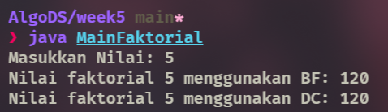
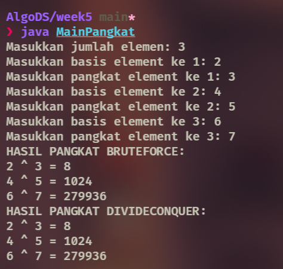
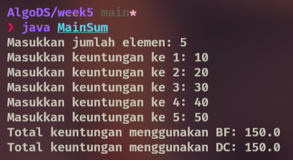

|  | Algoritma dan Struktur Data |
|--|--|
| NIM |  244107020102|
| Nama |  Singgih Wahyu Permana |
| Kelas | TI - 1H |
| Repository | [link](https://github.com/eeswepe/AlgoDS) |

# Brute Force dan Divide and Conquer

## 5. Praktikum

### 5.2 Menghitung Nilai Faktorial dengan Algoritma Brute Force dan Divide and Conquer

#### 5.2.1 Percobaan
setelah dilakukan langkah seperti pada jobsheet, dihasilkan sebuah file dengan nama [Faktorial.java](./Faktorial.java) dan [MainFaktorial.java](./MainFaktorial.java) 

#### 5.2.2 Verikasi Percobaan


#### 5.2.3 Pertanyaan

1. Bagian if pada fungsi tersebut merujuk kepada base case dari algoritma tersebut(faktorial), dimana sebuah faktorial dengan angka 0 atau 1 adalah 1. sedangkan untuk else, berfungsi untuk memecah masalah menjadi lebih kecil sehingga dapat menyentuh base case sebelum akhirnya diselesaikan
2. Ya, memungkinkan untuk mengganti sintaks perulangan untuk faktorial menjadi jenis selain for misal dengan while
```java
int hasil = 1;
int n = 5;
while(n > 0) {
    hasil *= n;
    n--;
}
return hasil;
```
3. Perbedaan dari kedua sintaks tersebut adalah pendekatan yang digunakan dan cara eksekusinya, dimana ketika menggunakan `fakto *= i` maka program tersebut akan langsung mengalikan nilai fakto dengan i, lalu mengubah nilai fakto (pendekatan bruteforce), sedangkan ketika menggunakan sintaks `fakto = n * faktorialDC(n-1)` maka program tersebut akan menunggu hasil dari base case dari fungsi faktorialDC, ketika hasil sudah didapat, maka program akan mengalikan hasil yang didapat untuk mendapatkan nilai faktorial yang dicari
4. Metode **faktorialBF()** (Brute Force) menghitung faktorial dengan **perulangan** dari 1 hingga n, sehingga lebih sederhana dan efisien dalam penggunaan memori. Sedangkan **faktorialDC()** (Divide and Conquer) menggunakan **rekursi**, memecah masalah menjadi bagian lebih kecil, tetapi lebih boros memori karena banyak pemanggilan fungsi berulang.

---
### 5.3 Menghitung Hasil Pangkat dengan Algoritma Brute Force dan Divide and Conquer

#### 5.3.1 Percobaan
setelah dilakukan langkah seperti pada jobsheet, dihasilkan sebuah file dengan nama [Pangkat.java](./Pangkat.java) dan [MainPangkat.java](./MainPangkat.java)

#### 5.3.2 Verikasi Percobaan


#### 5.3.3 Pertanyaan
1. Metode **pangkatBF()** (Brute Force) menghitung pangkat dengan **perulangan**, mengalikan `a` sebanyak `n` kali, sehingga lebih mudah dipahami tetapi kurang efisien jika `n` besar. Sedangkan **pangkatDC()** (Divide and Conquer) menggunakan **rekursi**, membagi masalah menjadi lebih kecil untuk mempercepat perhitungan, tetapi lebih boros memori karena banyak pemanggilan fungsi. 
2. Ya, combine sudah diterapkan. letaknya pada kode
```java
if (n % 2 == 1) {
    return (pangkatDC(a, n / 2) * pangkatDC(a, n / 2) * a);
} else {
    return (pangkatDC(a, n / 2) * pangkatDC(a, n / 2));
}
```
Setelah pangkatDC(a, n/2) dipanggil dua kali (divide & conquer), hasilnya dikalikan kembali untuk membentuk hasil akhir.

3. Metode **pangkatBF()** tetap bisa dibuat tanpa parameter jika sudah ada atribut nilai dan pangkat di dalam class Pangkat, sehingga langsung menggunakan atribut tersebut tanpa perlu melewatkan nilai saat pemanggilan.Berikut adalah bentuk dari fungsi pangkatBF() jika tidak menggunakan parameter.
```java
int pangkatBF() {
    int hasil = 1;
    for (int i = 0; i < this.pangkat; i++) {
        hasil *= this.nilai;
    }
    return hasil;
}
```

4. Metode **pangkatBF()** menghitung pangkat dengan **perulangan**, mengalikan `nilai` sebanyak `pangkat` kali secara langsung, sehingga sederhana tetapi kurang efisien jika `pangkat` besar. Sedangkan **pangkatDC()** menggunakan **rekursi**, membagi perhitungan menjadi sub-masalah lebih kecil untuk mempercepat proses, tetapi kurang optimal karena ada pemanggilan fungsi yang berulang sehingga dapat menimbulkan masalah `stackoverflow` jika pangkat yang diberikan terlalu besar.

---

### 5.4 Menghitung Sum Array dengan Algoritma Brute Force dan Divide and Conquer 

#### 5.4.1 Percobaan
setelah dilakukan langkah seperti pada jobsheet, dihasilkan sebuah file dengan nama [Sum.java](./Sum.java) dan [MainSum.java](./MainSum.java)

#### 5.4.2 Verikasi Percobaan


#### 5.4.3 Pertanyaan
1. Variabel mid pada metode totalDC() digunakan untuk membagi array menjadi dua bagian, sesuai dengan prinsip Divide and Conquer, tanpa variabel mid, array tidak akan bisa dipecah menjadi sub-masalah yang lebih kecil. 
2. statement tersebut berguna untuk memecah masalah yang ada menjadi masalah yang lebih kecil untuk diselesaikan.
3. return lsum+rsum dibutuhkan karena kita perlu mengcombine hasil dari kedua submasalah yang sudah diselesaikan.
4. base case dari totalDC() adalah ketika niali dari variabel l memiliki nilai yang sama dengan nilai variabel r 
5. Metode **totalDC()** menghitung total elemen array dengan **rekursi**, membagi array menjadi dua bagian hingga elemen terkecil, lalu menjumlahkan hasilnya untuk mendapatkan total keseluruhan.

---

### **5.5 Latihan Praktikum**

---

#### **5.5.1 Studi Kasus Mahasiswa**  

Dalam program ini, terdapat dua file utama, yaitu **Mahasiswa.java** dan **MainMahasiswa.java**.  

---

#### **1. Mahasiswa.java**  
File ini berisi deklarasi **class Mahasiswa**, yang merepresentasikan data mahasiswa dengan atribut dan metode penting.  

##### **Atribut**  
Class ini memiliki lima atribut utama:  
- **nama** → Menyimpan nama mahasiswa.  
- **nim** → Menyimpan Nomor Induk Mahasiswa (NIM).  
- **tahunMasuk** → Menyimpan tahun masuk mahasiswa.  
- **nilaiUTS** → Menyimpan nilai Ujian Tengah Semester (UTS).  
- **nilaiUAS** → Menyimpan nilai Ujian Akhir Semester (UAS).  

##### **Konstruktor**  
Class ini memiliki konstruktor berparameter yang memungkinkan inisialisasi langsung dengan nama, NIM, tahun masuk, nilai UTS, dan nilai UAS mahasiswa.  

##### **Method**  
Class ini memiliki tiga metode utama:  

- **nilaiUTSTertinggi(Mahasiswa[] arrayOfMhs, int awal, int akhir)**  
  → Menentukan mahasiswa dengan nilai UTS tertinggi menggunakan metode rekursi Divide and Conquer.  

- **nilaiUTSTerendah(Mahasiswa[] arrayOfMhs, int awal, int akhir)**  
  → Menentukan mahasiswa dengan nilai UTS terendah menggunakan metode rekursi Divide and Conquer.  

- **rataNilaiUAS(Mahasiswa[] arrayOfMhs)**  
  → Menghitung dan mengembalikan rata-rata nilai UAS dari seluruh mahasiswa dalam array menggunakan metode brute force.  

---

#### **2. MainMahasiswa.java**  
File ini merupakan program utama yang digunakan untuk mengelola data mahasiswa.  

##### **Objek yang Dibuat**  
Program ini membuat **delapan objek Mahasiswa** dengan data yang telah ditentukan dalam array.  

##### **Operasi yang Dilakukan**  
- Menyimpan daftar mahasiswa dalam **arrayOfMhs**.  
- Menentukan **mahasiswa dengan nilai UTS tertinggi**.  
- Menentukan **mahasiswa dengan nilai UTS terendah**.  
- Menghitung **rata-rata nilai UAS mahasiswa**.  
- Menampilkan hasil analisis tersebut ke layar.  

---

