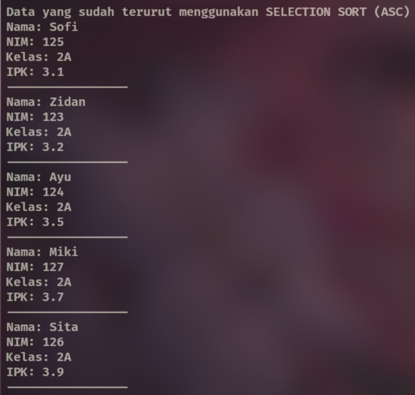
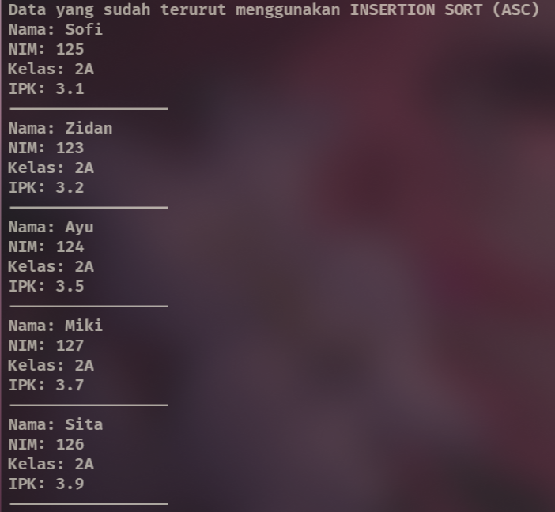
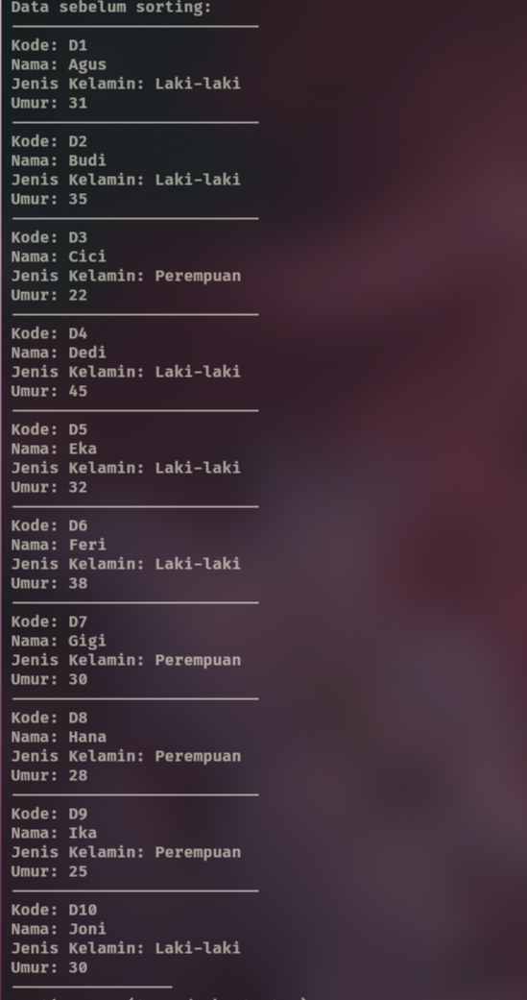
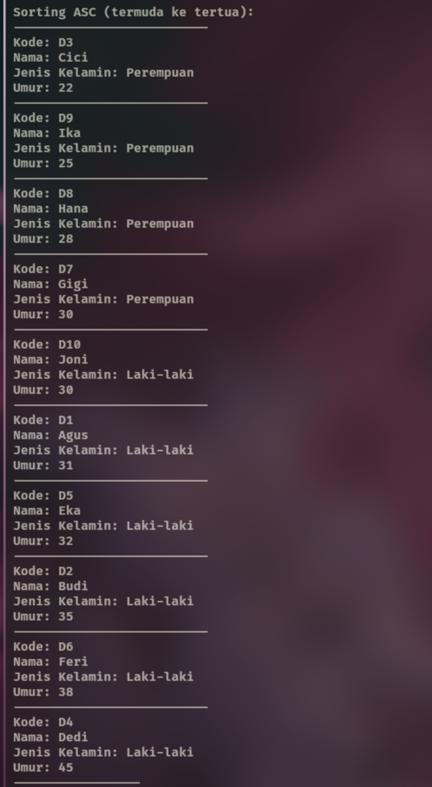
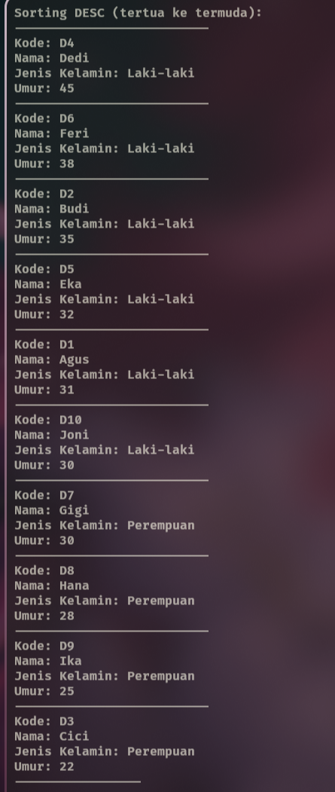

|  | Algoritma dan Struktur Data |
|--|--|
| NIM |  244107020102|
| Nama |  Singgih Wahyu Permana |
| Kelas | TI - 1H |
| Repository | [link](https://github.com/eeswepe/AlgoDS) |

# Sorting

## 5 Praktikum

### 5.2 Praktikum 1 - Mengimplementasikan Sorting Menggunakan Object

#### 5.2.1 Percobaan
setelah dilakukan langkah seperti pada jobsheet, dihasilkan sebuah file dengan nama [Sorting.java](./Sorting.java) dan [MainSorting.java](./MainSorting.java) 

#### 5.2.2 Verikasi Percobaan


#### 5.2.5 Pertanyaan

1. Kode tersebut mengecek apakah nilai dari data di sebelah kiri lebih besar dibandingkan dengan nilai data saat ini. Jika kondisi ini terpenuhi, maka pertukaran (swap) akan dilakukan. Dengan demikian, data yang lebih kecil akan berpindah ke sebelah kiri, sehingga menghasilkan urutan dari yang terkecil ke yang terbesar (dari kiri ke kanan).
2. 
```java
for (int j = i + 1; j < jumData; j++) {
  if (data[j] < data[min]) {
    min = j;
  }
}
```
3. Kode tersebut melakukan perulangan selama j >= 0 dan data[j] lebih besar dari temp. Dalam insertion sort, data dibagi menjadi dua bagian: sorted (kiri) dan unsorted (kanan). Data dari bagian unsorted diambil satu per satu, lalu dibandingkan dan disisipkan ke posisi yang benar di bagian sorted. While menentukan kapan elemen harus digeser ke kanan untuk memberi ruang bagi elemen baru. j digunakan untuk mengambil data yang dibandingkan, sedangkan i berfungsi sebagai key (temp). Perulangan ini memastikan elemen dari bagian unsorted masuk ke posisi yang tepat dalam bagian sorted.
4. tujuannya adalah untuk menggeser nilai di tempat saat ini ke tempat yang ada disebelah kanannya.

### 5.3 Praktikum 2 - Sorting Menggunakan Array of Objects

#### 5.3.1 Percobaan
setelah dilakukan langkah seperti pada jobsheet, dihasilkan sebuah file dengan nama [Mahasiswa26.java](./Mahasiswa26.java) dan [MahasiswaDemo26.java](./MahasiswaDemo26.java) dan [MahasiswaBerprestasi26.java](./MahasiswaBerprestasi26.java).

#### 5.3.3 Verifikasi Percobaan


#### 5.3.4 Pertanyaan

1. **a. Mengapa syarat dari perulangan i adalah `i < listMhs.length - 1`?**  
Karena dalam **Bubble Sort**, setiap iterasi akan menempatkan satu elemen terbesar ke posisi yang benar. Untuk **n** data, hanya diperlukan **n-1** iterasi agar seluruh data terurut. Oleh karena itu, perulangan **i** berlangsung hingga **listMhs.length - 1**.  

**b. Mengapa syarat dari perulangan j adalah `j < listMhs.length - i`?**  
Karena setiap iterasi **i**, elemen terbesar akan "menggelembung" ke posisi akhir, sehingga bagian yang sudah terurut tidak perlu dibandingkan lagi. Oleh karena itu, jumlah perulangan **j** berkurang sebanyak **i** setiap iterasi untuk menghindari pemeriksaan yang tidak perlu.  

**c. Jika jumlah data dalam `listMhs` adalah 50:**  
- **Perulangan `i` akan berlangsung sebanyak** `50 - 1 = 49` kali.  
- **Tahap Bubble Sort yang ditempuh** juga **49 tahap**, karena setiap tahap memastikan satu elemen terbesar berada di posisi yang benar.

2. Hasil Modifikasi Program
```java
    for (int i = 0; i < 5; i++) {
      System.out.print("Masukkan NIM: ");
      String nim = sc.next();
      System.out.print("Masukkan Nama: ");
      String nama = sc.next();
      System.out.print("Masukkan Kelas: ");
      String kelas = sc.next();
      System.out.print("Masukkan IPK: ");
      double ipk = sc.nextDouble();
      Mahasiswa26 m = new Mahasiswa26(nim, nama, kelas, ipk);
      list.tambah(m);
    }
```

#### 5.3.5 Mengurutkan Data Mahasiswa Berdasarkan IPK

Menambahkan algoritma selection sort

#### 5.3.6 Verifikasi Percobaan


#### 5.3.7 Pertanyaan

Bagian itu digunakan untuk mencari mahasiswa dengan IPK terkecil dari posisi saat ini sampai akhir. Hasilnya disimpan di idxMin supaya bisa ditukar nanti.

### 5.4 Mengurutkan Data Mahasiswa Menggunakan insertion sort

#### 5.4.1 Percobaan

Dalam Percobaan ini kita menambahkan insertion sort dan memanggilnya pada klas Demo.

#### 5.4.2 Verifikasi Percobaan



#### 5.4.3 Pertanyaan

Berikut merupakan kode insertion sort secara Descending


```java
public void insertionSort() {
  for (int i = 1; i < listMhs.length; i++) {
    Mahasiswa26 temp = listMhs[i];
    int j = i;
    while (j > 0 && listMhs[j - 1].ipk < temp.ipk) {
      listMhs[j] = listMhs[j - 1];
      j--;
    }
    listMhs[j] = temp;
  }
}
```

### 5.5 Latihan Praktikum
 Berikut merupakan hasil running dari program yang telah dibuat sesuai dengan panduan diagram klas yang ada




