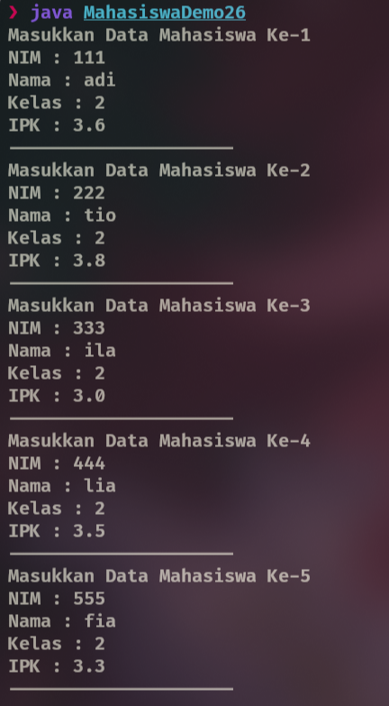
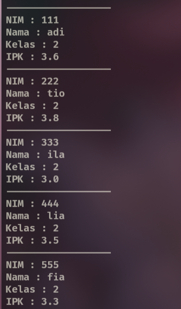
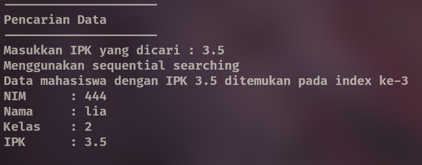
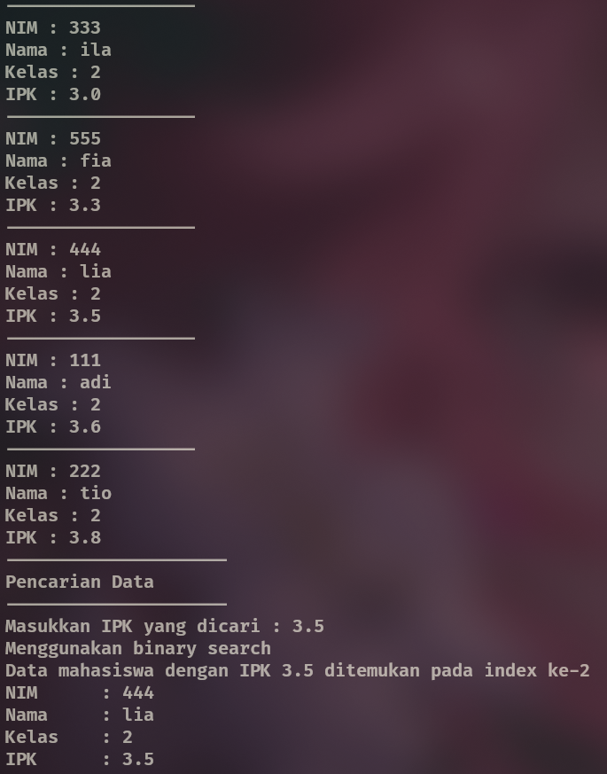
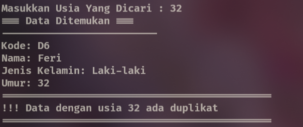
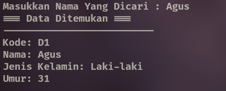

|  | Algoritma dan Struktur Data |
|--|--|
| NIM |  244107020102|
| Nama |  Singgih Wahyu Permana |
| Kelas | TI - 1H |
| Repository | [link](https://github.com/eeswepe/AlgoDS) |

# Searching

## 6 Praktikum

### 6.2 Searching menggunakan sequential searching

#### 6.2.1 Langkah Percobaan
Setelah melakukan langkah percobaan sesuai dengan petunjuk yang diberikan, dihasilkan 3 file, yaitu [Mahasiswa26.java](./Mahasiswa26.java), [MahasiswaDemo26.java](./MahasiswaDemo26.java), dan [MahasiswaBerprestasi26.java](./MahasiswaBerprestasi26.java)

#### 6.2.2 Verifikasi Percobaan







#### 6.2.3 Pertanyaan

1. TampilPosisi() menampilkan posisi (index) mahasiswa dalam array berdasarkan IPK yang dicari.
tampilDataSearch() menampilkan detail lengkap data mahasiswa pada posisi tersebut.
2. Break Berfungsi untuk menghentikan pencarian ketika sudah menemukan nilai ipk mahasiswa dengan nilai yang diberikan.

### 6.3 Searching menggunakan binary searching

#### 6.3.1 Langkah Percobaan
Menambahkan fungsi binary search

#### 6.3.2 Verifikasi Percobaan


#### 6.3.3 Pertanyaan

1. Bagian devide terletak pada `mid = (left + right) / 2;` dimana kode tersebut "membagi" batas pencarian menjadi 2.
2. Bagian conquer terletak pada bagian kode ini
```java
  if (cari == listMhs[mid].ipk) {
    return mid;
  } else if (listMhs[mid].ipk > cari) {
    return findBinarySearch(cari, left, mid - 1);
  } else {
    return findBinarySearch(cari, mid + 1, right);
  }
```
dimana kode tersebut mengecek nilai tengah dari array yang diberikan dan menentukan langkah selanjutnya.

3. Tidak berjalan, hal ini terjadi karena sesuai proses conquer tadi, kita akan menentukan langkah selanjutnya melalui pengecekan kondisi apakah nilai tengah dari array itu lebih besar atau lebih kecil dari nilai yang dicari

4. Jika data yang diberikan terurut secara DESC seperti yang dicontohkan, algoritma kita tetap tidak akan bekerja, hal ini karena pengecekan yang ada bekerja hanya untuk urutan ASC. Kode yang dilakukan penyesuaian untuk urutan array DESC sebagai berikut
```java
    public int findBinarySearch(double cari, int left, int right) {
        int mid;
        if (right >= left) {
            mid = (left + right) / 2;
            if (cari == listMhs[mid].ipk) {
                return mid;
            } else if (listMhs[mid].ipk < cari) {
                return findBinarySearchDescending(cari, left, mid - 1); 
            } else {
                return findBinarySearchDescending(cari, mid + 1, right);
            }
        } else {
            return -1;
        }
    }
```

5. untuk mengubah seperti yang diinginkan, saya memilih untuk menggunakan konstruktor berparameter untuk menghindari memory leak. kode yang tertera dalam file [MahasiswaBerprestasi26.java](./MahasiswaBerprestasi26.java) dan [MahasiswaDemo26](./MahasiswaDemo26.java) merupakan kode yang diubah untuk dapat memasukkan jumlah mahasiswa sesuai input dari keyboard user

### 6.5 Latihan Praktikum
berikut adalah screenshot dari program dari minggu ke-6 yang telah dimodifikasi. 




